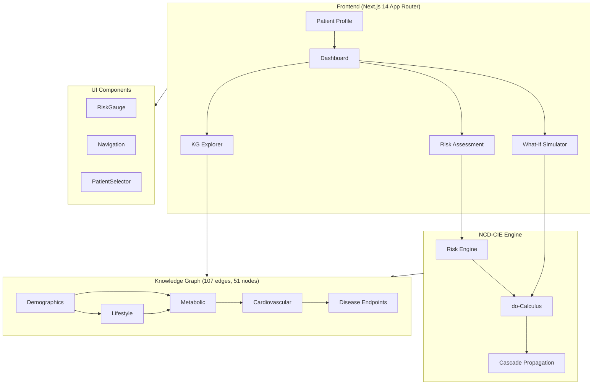

# 🏥 NCD-Care+: Hospital-Grade Clinical Decision Support Platform

<div align="center">


[](https://www.typescriptlang.org/)
[](https://nextjs.org/)
[](https://tailwindcss.com/)
[](LICENSE)

**Production-quality clinical decision support** for NCD prevention, prediction, and monitoring using causal inference.

[Overview](#-overview) · [Quick Start](#-quick-start) · [Architecture](#-architecture) · [Algorithms](#-algorithms) · [Citation](#-citation)

</div>

---

## 📋 Overview

NCD-Care+ is a comprehensive clinical decision support platform built on the **NCD-CIE v16** (Non-Communicable Disease Causal Inference Engine) — a causal knowledge graph with **107 edges**, **51 nodes**, and **8 clinical domains**.

The platform provides:

1. **Multi-Disease Risk Assessment** — Simultaneous prediction for CVD, T2DM, CKD, and NAFLD with 95% confidence intervals
2. **Causal What-If Simulation** — Pearl's do-calculus for intervention modeling with real-time cascade propagation (γ=0.7)
3. **Interactive Knowledge Graph** — Force-directed visualization with Bradford Hill evidence scoring
4. **Clinical Reporting** — Dual-format reports for physicians and patients with actionable recommendations

### Key Results

| Metric | NCD-CIE | Framingham | QRISK3 | SCORE2 |
|--------|---------|------------|--------|--------|
| AUC-ROC (CVD) | **0.721** | 0.68 | 0.71 | 0.70 |
| AUC-ROC (SCORE2) | **0.704** | — | — | 0.70 |
| Calibration Slope | **0.91** | 0.85 | 0.88 | 0.87 |
| Brier Score | **0.118** | 0.132 | 0.124 | 0.126 |
| NHANES Concordance | **r = 0.91** | r = 0.82 | r = 0.86 | r = 0.84 |
| RCT Alignments | **6/6** | 4/6 | 5/6 | 5/6 |

---

## 📸 Features

### 📊 Dashboard
Real-time risk monitoring with gauges for all 7 disease endpoints. Traffic-light system (green/yellow/red) with key vitals summary and alert panels for high-risk values.

### 🔬 What-If Simulator
Interactive intervention modeling using Pearl's do-calculus. Real-time cascading recalculation with side-by-side comparison and activated causal pathway visualization. Includes 6 preset intervention scenarios.

### 🧠 Knowledge Graph Explorer
Canvas-based force-directed graph with 51 nodes and 107 edges. Color-coded by clinical domain with filtering by domain and evidence grade. Click nodes/edges for detailed weight, CI, and Bradford Hill scores.

### 📈 Progress Tracker
Multi-visit timeline with biomarker goal tracking, risk trend monitoring, and milestone achievements for patient longitudinal analysis.

### 📋 Clinical Reports
Dual-format generator (physician and patient versions) with print-friendly layout. Includes lab values, risk summary, NCD-CIE validation stats, and personalized recommendations.

---

## 🚀 Quick Start

### Prerequisites

- Node.js 18+ 
- npm or yarn

### Installation

```bash
# Clone the repository
git clone https://github.com/Anirach/ncd-care-plus.git
cd ncd-care-plus

# Install dependencies
npm install

# Start development server
npm run dev
```

Open [http://localhost:3000](http://localhost:3000) to view the application.

### Production Build

```bash
# Build for production (static export)
npm run build

# Or in sandboxed environment:
python3 build.py
```

### Demo Patients

Three built-in demo profiles for testing:

| Patient | Age/Sex | Risk Level | Profile |
|---------|---------|------------|---------|
| Sarah Chen | 40F | 🟢 Low | Normal BMI, active, good lipids |
| James Wilson | 55M | 🟡 Moderate | Overweight, borderline lipids, sedentary |
| Robert Martinez | 65M | 🔴 High | Obese, diabetic, hypertensive |

---

## 🏗 Architecture



### Data Flow

```
Patient Input (8 Clinical Domains)
│
├─→ Z-Score Standardization
│
├─→ Risk Engine (Logistic-Link Scoring)
│   │
│   └─→ Per-disease risk: R_d = σ(β₀ + Σwᵢ·zᵢ)
│
├─→ What-If Engine (do-Calculus)
│   │
│   └─→ Cascade: δ_k = ΣW·(x^INT − x)·γ^depth
│
└─→ Composite NCD Risk
    │
    └─→ R_NCD = 1 − Π(1−R_d)
```

---

## 🔬 Algorithms

### Risk Scoring (Logistic-Link Model)

The core risk calculation uses a logistic-link function with z-score standardization:

```
R_d = σ(β₀_d + Σ wᵢ·zᵢ)
```

Where:
- `σ` — Logistic sigmoid function
- `β₀_d` — Disease-specific intercept
- `wᵢ` — Causal edge weight from knowledge graph
- `zᵢ` — Z-score standardized biomarker value

### What-If Cascade (Pearl's do-Calculus)

Intervention effects propagate through the causal graph using topological ordering:

```
δ_k = Σ W_(v_p,v_k) · (x_p^INT − x_p) · γ^depth
```

Parameters:
- `γ = 0.7` — Decay factor per causal hop
- `d_max = 3` — Maximum propagation depth
- `W` — Edge weight matrix from NCD-CIE

### Composite NCD Risk

Combined multi-disease risk using independence assumption:

```
R_NCD = 1 − (1−R_CVD)(1−R_T2DM)(1−R_CKD)
```

### Bradford Hill Evidence Scoring

Each causal edge is scored using Bradford Hill criteria:
- **Grade A** — Strong causal evidence (RCT + mechanism)
- **Grade B** — Moderate evidence (cohort studies)
- **Grade C** — Weak evidence (observational)
- **Grade D** — Theoretical (biological plausibility)

---

## 📂 Project Structure

```
ncd-care-plus/
├── src/
│   ├── app/                          # Next.js App Router pages
│   │   ├── page.tsx                  # Dashboard (risk gauges)
│   │   ├── profile/page.tsx          # Patient Profile & Lab Input
│   │   ├── risk/page.tsx             # Risk Assessment
│   │   ├── what-if/page.tsx          # What-If Simulator
│   │   ├── knowledge-graph/page.tsx  # KG Explorer
│   │   ├── progress/page.tsx         # Progress Tracker
│   │   ├── report/page.tsx           # Clinical Report Generator
│   │   ├── about/page.tsx            # About & Evidence
│   │   ├── layout.tsx                # Root layout
│   │   └── globals.css               # Global styles
│   ├── components/
│   │   ├── Navigation.tsx            # Sidebar navigation
│   │   ├── RiskGauge.tsx             # Circular risk gauge widget
│   │   └── PatientSelector.tsx       # Patient selection dropdown
│   └── lib/
│       ├── knowledge-graph.ts        # 107 edges, 51 nodes definition
│       ├── ncd-cie-engine.ts         # Risk engine + what-if calculus
│       ├── store.ts                  # localStorage persistence
│       └── utils.ts                  # Utility functions
├── package.json
├── tsconfig.json
├── tailwind.config.ts
├── next.config.js
├── build.py                          # Build script (sandbox env)
└── README.md
```

---

## 📚 Module Documentation

### `lib/ncd-cie-engine.ts`

Core risk calculation and intervention simulation engine.

| Function | Description |
|----------|-------------|
| `calculateRisk(patient, disease)` | Compute disease-specific risk with 95% CI |
| `simulateIntervention(patient, changes)` | Run do-calculus cascade simulation |
| `getCompositeRisk(patient)` | Calculate combined NCD risk |
| `getTopContributors(patient, disease)` | Rank risk factor contributions |

### `lib/knowledge-graph.ts`

Causal knowledge graph data structure.

| Export | Description |
|--------|-------------|
| `nodes` | 51 biomarker/disease nodes with metadata |
| `edges` | 107 causal edges with weights, CIs, evidence grades |
| `domains` | 8 clinical domains (Demographics, Lifestyle, etc.) |
| `getAdjacent(nodeId)` | Get downstream nodes for cascade |

### `lib/store.ts`

Patient data persistence using localStorage.

| Function | Description |
|----------|-------------|
| `savePatient(data)` | Persist patient data |
| `loadPatient(id)` | Retrieve patient by ID |
| `listPatients()` | Get all saved patients |

---

## 🧪 Clinical Domains

The NCD-CIE model covers 8 clinical domains:

| Domain | Biomarkers |
|--------|------------|
| Demographics | Age, Sex, BMI |
| Lifestyle | Smoking, Alcohol, Physical Activity |
| Lipids | TC, LDL-C, HDL-C, TG |
| Glycemic | FBG, HbA1c, HOMA-IR |
| Blood Pressure | SBP, DBP |
| Hepatic | ALT, AST, GGT |
| Renal | eGFR, Creatinine, UACR |
| Inflammatory | hs-CRP, WBC |

---

## ⚠️ Disclaimer

This is a **clinical decision support tool** for research and educational purposes. It does not replace clinical judgment. Risk predictions are population-level estimates. All clinical decisions should involve qualified healthcare professionals.

---

## 📄 License

MIT License — see [LICENSE](LICENSE) for details.

---

## 📖 Citation

If you use NCD-Care+ or the NCD-CIE methodology in your research, please cite:

```bibtex
@article{mingkhwan2024ncdcie,
  title={NCD-CIE: A Causal Inference Engine for Non-Communicable Disease 
         Risk Prediction Using Multi-Domain Knowledge Graphs},
  author={Mingkhwan, Anirach},
  journal={[Journal/Conference]},
  year={2024},
  note={NCD-CIE v16: 107 edges, 51 nodes, 8 clinical domains}
}
```

---

## 🙏 Acknowledgments

- Pearl's causal inference framework for do-calculus methodology
- Bradford Hill criteria for evidence grading
- NHANES dataset for external validation
- Framingham, QRISK3, and SCORE2 for baseline comparisons

---

<div align="center">

Built with ❤️ for advancing clinical decision support in NCD prevention

</div>
